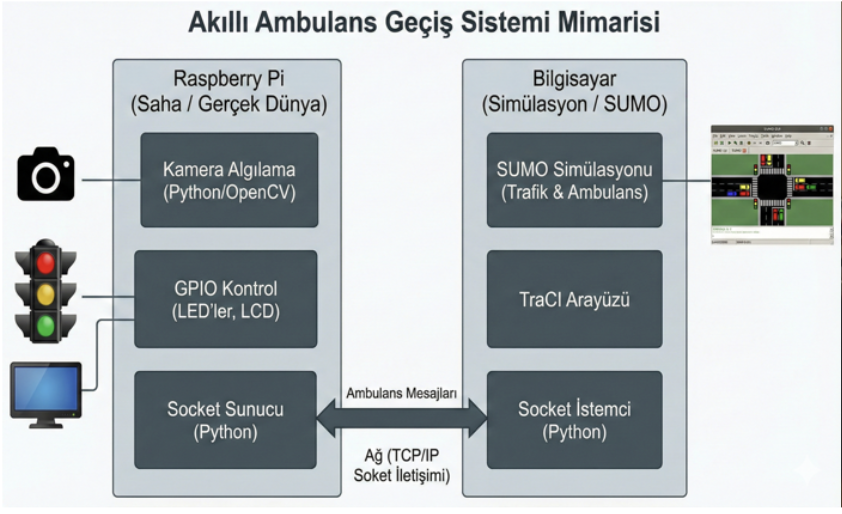
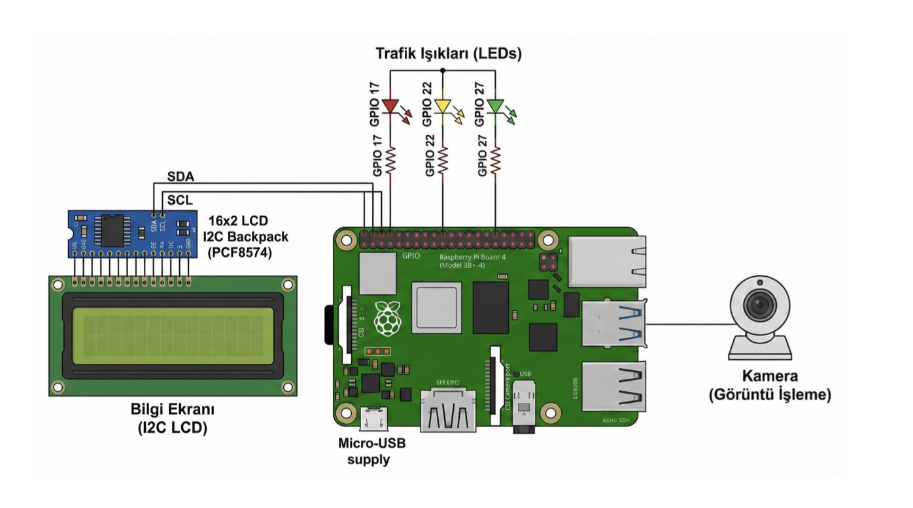

# 🚦 IoT-Enabled Smart Traffic Digital Twin

This project presents an **IoT-based Smart Traffic Management System** integrated with a **Digital Twin architecture** to simulate, monitor, and optimize real-time traffic flow.

The system combines IoT data collection, intelligent traffic analysis, and digital twin simulation to improve urban traffic efficiency, reduce congestion, and enable data-driven decision-making.

---

## 🚀 Project Overview

With the rapid growth of smart cities, traffic congestion has become a critical challenge. This project addresses the problem by:

- Collecting real-time traffic data using IoT-based approaches  
- Creating a **digital twin** of traffic systems  
- Simulating real-world traffic conditions  
- Optimizing traffic signals dynamically  

---

## 🧠 System Architecture

The system consists of three main layers:

### 1. IoT Layer
- Collects real-time traffic data  
- Represents physical world (vehicles, signals, density)

### 2. Data Processing Layer
- Processes incoming traffic data  
- Performs traffic analysis and decision-making  

### 3. Digital Twin Layer
- Creates a virtual replica of traffic system  
- Simulates traffic behavior  
- Enables predictive analysis  

---

## 🔌 Hardware & Circuit Design

This diagram represents the hardware-level implementation of the system, including sensors, communication modules, and control units used for traffic data collection and signal management.

The circuit design enables:
- Real-time data acquisition from the environment  
- Communication between IoT components  
- Integration with the digital twin system  

---

## 🚗 SUMO Simulation Integration

This project utilizes **Simulation of Urban Mobility (SUMO)**, an open-source traffic simulation tool, to model and analyze real-world traffic scenarios within the digital twin environment.

SUMO enables realistic and scalable traffic simulations by modeling:

- Vehicle movements and routes  
- Traffic signals and intersections  
- Road network behavior  
- Traffic density and congestion patterns  

---

## ⚙️ Role of SUMO in This Project

In this system, SUMO is used as the **core simulation engine** of the digital twin:

- Generates realistic traffic flow scenarios  
- Simulates real-time traffic conditions  
- Tests different traffic signal strategies  
- Evaluates system performance under varying conditions  

The integration of SUMO allows the digital twin to closely reflect real-world traffic dynamics and enables data-driven optimization.

---

## 🔍 Why SUMO?

- Open-source and widely used in academia & industry  
- Highly customizable traffic scenarios  
- Supports real-time simulation and control  
- Compatible with Python (TraCI API)  
- Ideal for smart city and IoT-based traffic systems  

---

## 🔗 SUMO + Digital Twin

By combining SUMO with IoT data:

- Real-world data → feeds simulation  
- Simulation → predicts future traffic states  
- System → optimizes traffic signals dynamically  

This creates a **closed feedback loop**, which is a core principle of digital twin systems.

---

## ⚙️ Features

- Real-time traffic monitoring  
- IoT-based data collection  
- Digital twin simulation  
- Traffic signal optimization  
- Scalable and modular architecture  
- Smart city integration capability  

---

## 🧩 How It Works

1. IoT devices/sensors collect traffic data  
2. Data is sent to processing system  
3. Traffic conditions are analyzed  
4. Digital twin simulates the environment  
5. Optimal traffic decisions are generated  

---

## 📊 Use Cases

- Smart city traffic optimization  
- Emergency vehicle prioritization  
- Traffic congestion prediction  
- Urban planning simulations  
- Autonomous vehicle testing environments  

---

## 🛠️ Technologies Used

- Python  
- IoT Systems  
- SUMO (Simulation of Urban Mobility)  
- Digital Twin Architecture  
- Data Processing & Analysis  

---

## 💡 Key Concepts

- Internet of Things (IoT)  
- Digital Twin Systems  
- Smart Cities  
- Real-time Data Processing  
- Traffic Optimization  

---

## 📈 Future Improvements

- Integration with AI/ML models  
- Real-time dashboard (web interface)  
- Edge computing support  
- Cloud-based deployment  
- Reinforcement learning for signal optimization  

---

## 💼 Experience & Contribution

This project demonstrates:

- System design for real-world problems  
- IoT + Digital Twin integration  
- Smart city solution development  
- End-to-end project implementation  
